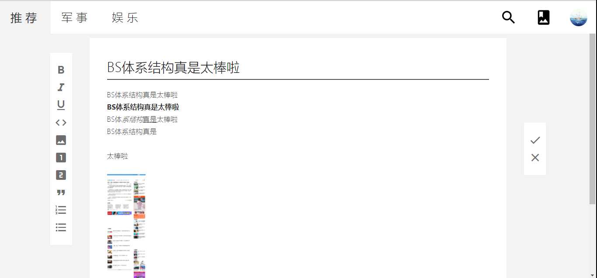

# CutCut 

A RSS website able to cut and edit articles making collections.

## Function
+ 定时自动爬取腾讯新闻、新浪新闻等内容
+ 支持根据用户浏览量、用户对栏目的兴趣来个性化推荐新闻
+ 支持用户对新闻进行剪裁并编辑，生成自己的剪报
+ 支持安卓平台并可以进行新消息的推送
+ 新闻列表支持随机化布局

## To Do
+ [ ] 对动态渲染页面进行截图
+ [ ] 更复杂的推荐算法
+ [ ] 剪报广场
+ [ ] 采用推送服务进行实时推送

## Run & Build
请参照具体子目录下的README

## Demo

